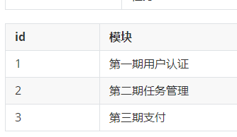

# day13文件管理 下载功能

- 下载文件
- 项目删除
- 问题管理：
  - 表结构
  - 新建问题
  - 问题展示列表
  - 分页

## 今日详情

### 1.下载文件

```python
def download(request):
	# 打开文件，获取文件的内容
	with open('xxx.png','rb') as f:
		data = f.read()
    response HttpResponse(data)
    response['x'] = value
    # 设置响应头
    response['Content-Dsaposition'] = 'attachment; filename=xxx.png'
    return response
```

### 2.删除项目

- 项目删除
- 桶删除

### 3.问题管理

#### 3.1 设计表结构

```
- 产品经理：功能+原型图
- 开发人员：表结构设计
```

| id   | 标题 | 内容 | 问题类型fk | 模块fk | 状态ch | 优先级ch | 指派fk | 关注m2m | 开始时间 | 截止时间 | 模式 | 父问题 |
| ---- | ---- | ---- | ---------- | ------ | ------ | -------- | ------ | ------- | -------- | -------- | ---- | ------ |
|      |      |      |            |        |        |          |        |         |          |          |      |        |
|      |      |      |            |        |        |          |        |         |          |          |      |        |
|      |      |      |            |        |        |          |        |         |          |          |      |        |

| id   | 问题类型 | 项目id |
| ---- | -------- | ------ |
| 1    | 功能     |        |
| 2    | bug      |        |
| 3    | 任务     |        |

| id   | 模块           | 项目id |
| ---- | -------------- | ------ |
| 1    | 第一期用户认证 |        |
| 2    | 第二期任务管理 |        |
| 3    | 第三期支付     |        |



#### 3.2 新建问题

##### 3.2.1 模态对话框

- 显示对话框

- 显示用户要填写的表单

- 前端插件

  - editormd

  - bootstrap-datepicker

    - ```
      css
      js
      找到标签变化
      ```

  - bootstrap-select

    - ```
      css
      js
      modelForm中添加属性修改
      ```

      

#### 3.3 问题列表

#### 3.4 自定义分页