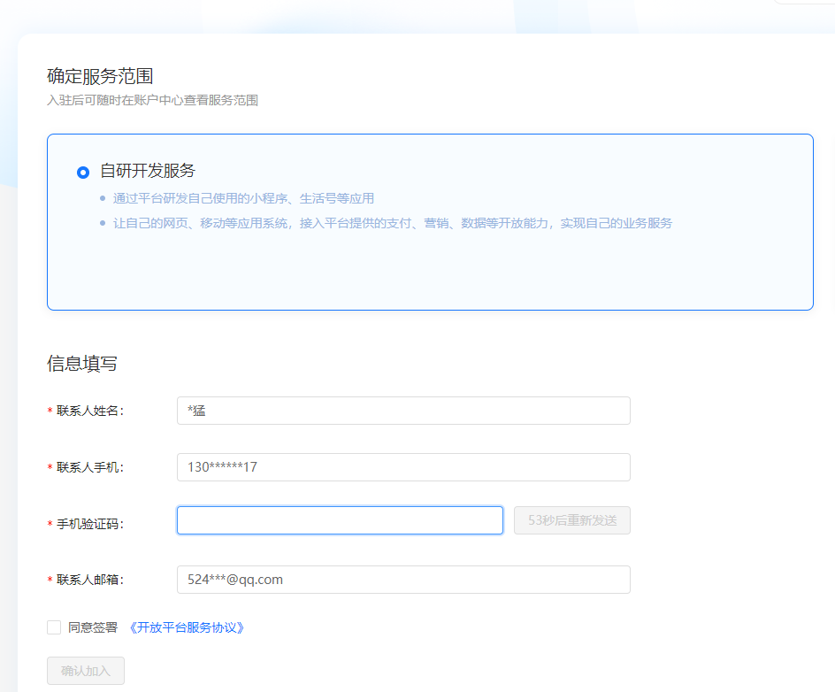
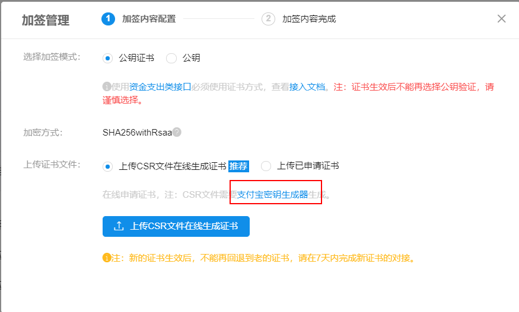
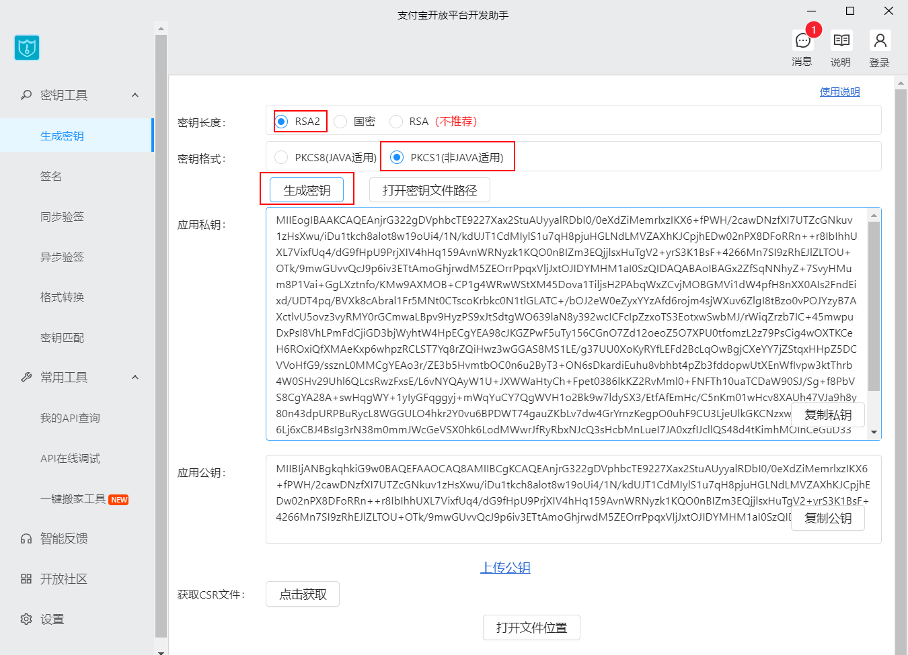
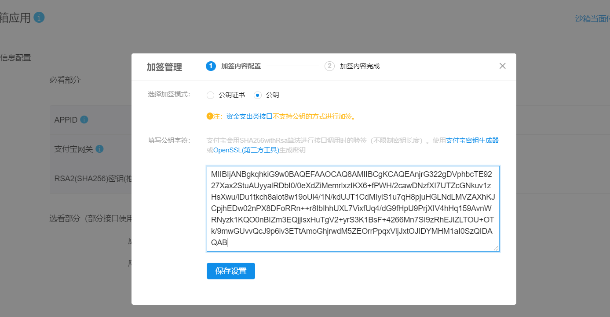
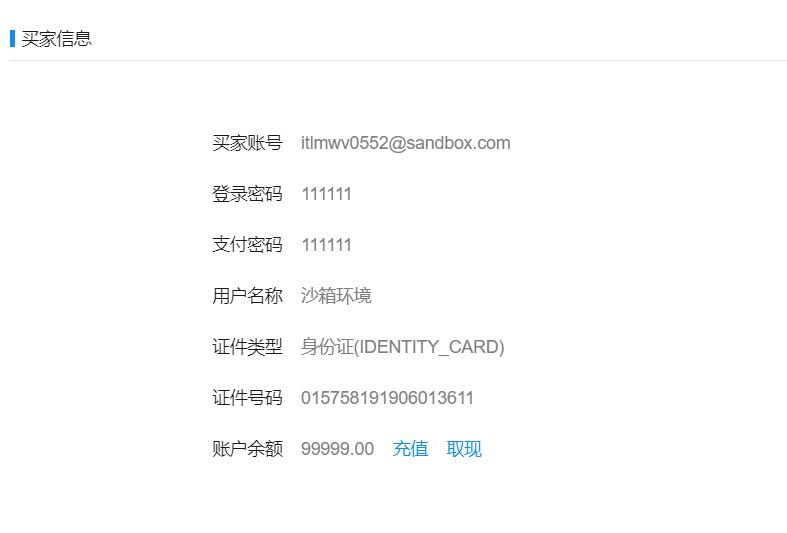
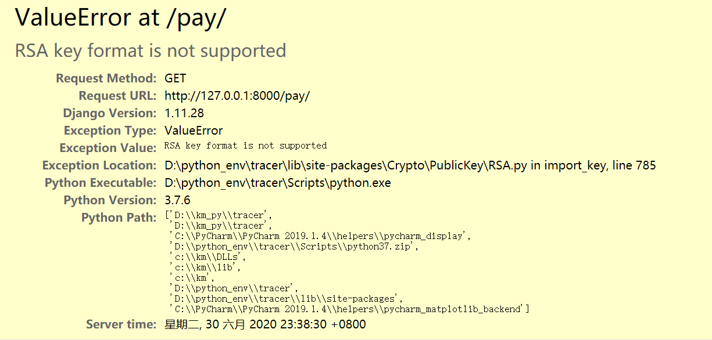
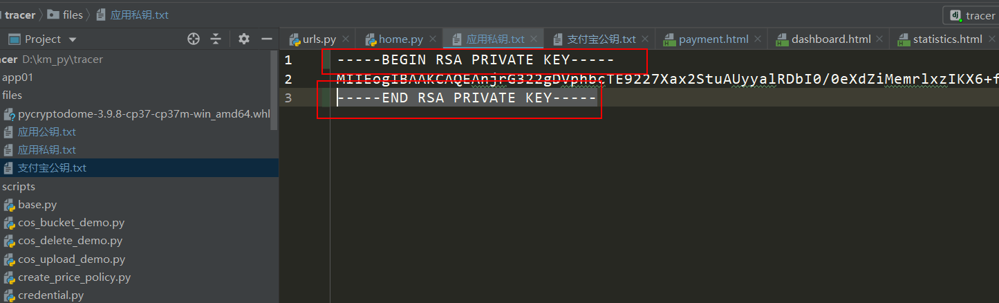
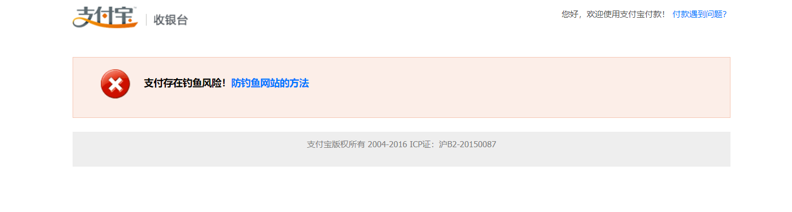

# day17


## 今日概要

- 统计报表

  支付


## 今日详细

### 1 django时区

```python
# datetime.datetime.now() 获取到的是UTC时间/ datetime.datetime.UTCnow()
# TIME_ZONE = 'UTC'

# 获取到的是东八区的时间
TIME_ZONE = 'Asia/Shanghai'

USE_I18N = True

USE_L10N = True


# 影响自动生成数据库时间字段
# USE_TZ=True 创建UTC时间写入数据库
# USE_TZ=False 根据TIME_ZONE设置的时区写入数据库
# USE_TZ = True
USE_TZ = False

```

### 2 bug


### 3 画图

网页上画图：HighCharts/Echarts

#### 3.1 下载

https://www.highcharts.com.cn/download

#### 3.2 应用

```html
<script src="http://cdn.highcharts.com.cn/highcharts/8.1.2/highcharts.js"></script>
```

#### 3.3 中文包

- 提供js中文包文件
- 不提供

#### 总结：

- 下载并引用

- 应用：

  - 引入js
  - 定义div
  - js进行配置

- 需求：根据demo中变化+api

- 注意事项：series

  - 生成单条的图

    ```
    series:[
    	{
    		data:[]
    	}
    ]
    ```

    

  - 生成多个数据

    ```
    series:[
    	{
    		name:'',
    		data:[]
    	},
    	{
    		name:'',
    		data:[]
    	},
    	{
    		name:'',
    		data:[]
    	},
    ]
    ```

### 4 统计

#### 4.1 daterangepicker

注意js的引入数据

```html
<script src=""></script>
    <script src=""></script>
```


#### 4.1 饼图


#### 4.2 柱状图


## 重点难点

- 前端的配置，前端查看文档一个个试验
- 数据处理，前端所需格式的数据


### 5 支付

#### 5.1 点击价格展示套餐

#### 5.2 支付页面

#### 5.3 订单列表

### 支付宝支付

- 正式环境：需要营业执照等信息
- 沙箱环境：模拟真实的环境

#### 1 申请开通沙箱环境



得到APPID和网关

- APPID  2016102600763653
- 支付宝网关： https://openapi.alipaydev.com/gateway.do
  - 正式网关： https://openapi.alipay.com/gateway.do

#### 2 生成密钥

##### 2.1 下载密钥生成器

- 应用公钥
- 应用私钥：对url传入的数据签名加密
- 支付宝公钥：通过应用公钥生成，页面支付成功后跳转回来时，对支付宝给我们传的值进行校验





##### 2.2 上传应用公钥并获得支付宝公钥



#### 3 账户信息和测试APP



- 买家信息

```
买家账号itlmwv0552@sandbox.com
登录密码111111
支付密码111111
用户名称沙箱环境
证件类型身份证(IDENTITY_CARD)
证件号码015758191906013611
账户余额
99999.00充值取现
```

- 商家信息

```
商家账号mcrlfp9754@sandbox.com
商户UID2088102181124187
登录密码111111
账户余额
0.00充值取现
```

#### 4 两种支持

- SDK 写好的一个python模块

```python
pip install alipay-sdk-python==3.3.398
```

- API
  - https://opendocs.alipay.com/apis/api_1/alipay.trade.page.pay

```
https://opendocs.alipay.com/apis/api_1/alipay.trade.page.pay
```

```
跳转的地址：网关+参数
参数 = {
	app_id:'',
	method;'',
	format:'',
	return_url:'支付成功后跳转的页面',
	notify_url:'后台偷偷发送post请求',
	charset:'utf-8',
	sign_type:'RSA2',
	sign:'',
	timestamp:'2014-07-24 03:07:50',
	version:'1.0',
	biz_content:{
		out_trade_no:'订单号',
		product_code：'FAST_INSTANT_TRADE_PAY',
		total_amount:2222.22,
		subject:'订单标题',
	},
}
```

```
如果支付成功之后父，服务器宕机，如果处理？
	偷偷向notify_url发送请求，
	服务器宕机，支付宝访问不到，则会在24小时以内发送8次请求：4m,10m,10m,1h,2h,6h,15h
	网站接收到支付宝请求之后，返回数据不正确，也会一直发送请求。
	返回一个字符串'success'
```

```
支付宝签名：处理传递的参数，处理完成后与网关连接。
- 1 剔除参数中的空、文件、字节、sign
	params.pop(sign)
- 2 排序，对参数中所有的key进行从小到大排序 sort(params)
- 3 将排序后的参数与其对应值，组合成“参数=参数值”的格式，并且把这些参数用 & 字符连接起来，此时生成的字符串为待签名字符串。
	'app_id=xx&method=xxx&'
	注意：1.如果参数中存在字典，需要转换成字符串
		 2.字符串中间不能有空格 json.dumps(dict, separators=(',',':')) 去除json序列化后的空格
- 4 使用各自语言对应的 SHA256WithRSA签名函数利用应用私钥对待签名字符串进行签名，并进行 Base64 编码。
	result = 待签名
	签名 = result进行Base64编码
	
	签名添加到params字典中 params[sign] = 签名
	注意：base64编码之后，内部不能有换行符 签名.replace('\n','')
- 5 再将所有的参数拼接起来
	注意：在拼接url的时候不能出现；，（等字符，提前将这些特殊的字符转换为url转义的字符
	from urllib.parse import quote_plus
	
	
```

```python
# pip install pycrypto

pycryptodome-3.9.8-cp37-cp37m-win_amd64.whl
```

#### 5 常见报错






#### 6 常见错误 钓鱼网站




## 项目开发流程

需求整理

功能设计

表结构设计

开发，代码都是运行在自己的电脑上

- 前端
- 后端

运维，把代码部署到服务器

- 电脑+公网ip+域名
- 域名解析：域名-ip绑定-电脑

linux操作系统